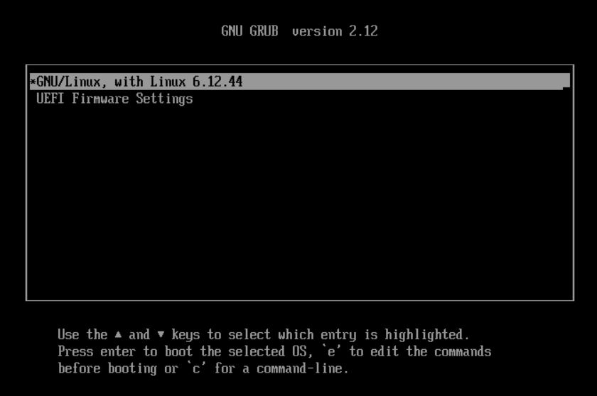
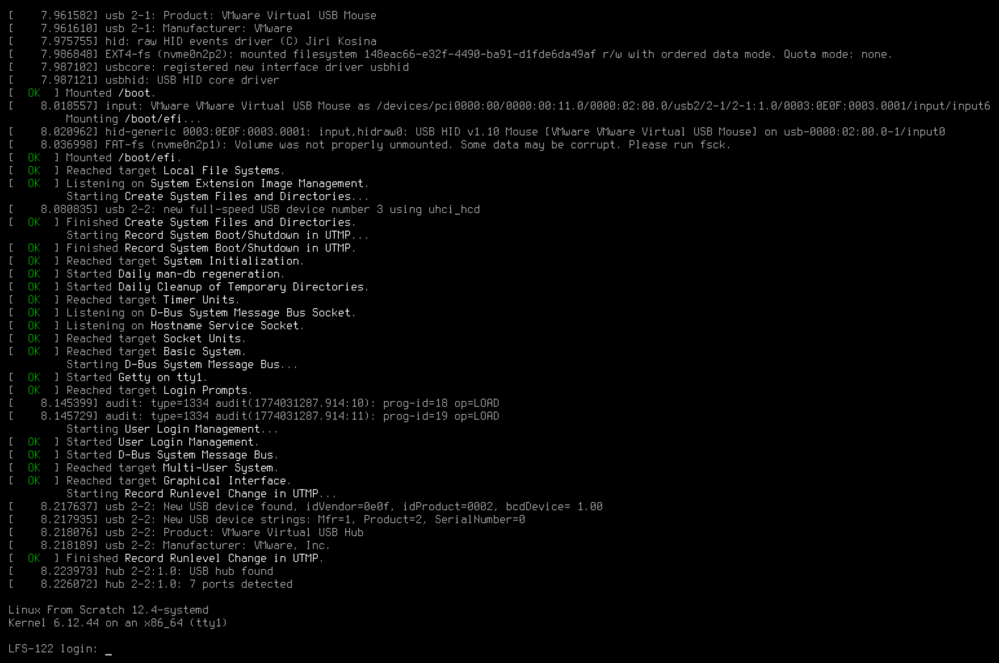

# lfs.SlackBuild

## Documents and Scripts

| File                                                                 | Description                                                                                            |
| -------------------------------------------------------------------- | ------------------------------------------------------------------------------------------------------ |
| [LFS-BOOK-SYSD-12.4-NOCHUNKS.html](LFS-BOOK-SYSD-12.4-NOCHUNKS.html) | The book of Linux From Scratch (Version 12.4-systemd)                                                  |
| [LFS-SYSD-BOOK.html](LFS-SYSD-BOOK.html)                             | The book of Linux From Scratch in Chinese (Version 12.4-systemd)                                       |
| [version-check.sh](version-check.sh)                                 | Check host system at the very beginning                                                                |
| [chroot.sh](chroot.sh)                                               | From the host system, switch to the LFS system                                                         |
| [chroot-clean.sh](chroot-clean.sh)                                   | From the host system, clear the LFS system’s temporary mounts (`/dev/`, `/proc/`, `/run/` and `/sys/`) |

## Clone Repository

Make sure you have [Git](https://git-scm.com/) and [Git LFS](https://git-lfs.com/) installed on your host system.

```bash
git clone https://github.com/Arondight/lfs.SlackBuild.git
cd ./lfs.SlackBuild/
git lfs pull
```

## Build pkgtools

After finishing Chapter **III: Building the LFS Cross Toolchain and Temporary Tools** (**III. 构建 LFS 交叉工具链和临时工具**) in the LFS book, copy the `installpkg` and `makepkg` scripts to `/usr/sbin/` in the chroot environment so they can be used to build pkgtools.

```bash
cd ./pkgtools/
install -v -m 0755 ./scripts/{install,make}pkg /usr/sbin/
```

Run the SlackBuild for the `pkgtools` package, build and install it.

```bash
./pkgtools.SlackBuild
installpkg /tmp/pkgtools-15.0-noarch-42.txz
```

Then build LFS system.

## Bootup LFS system

In host system, mount LFS device, for example.

```
NAME   MAJ:MIN RM   SIZE RO TYPE MOUNTPOINTS
sda      8:0    0 119.2G  0 disk
├─sda1   8:1    0   512M  0 part /mnt/lfs/boot/efi
├─sda2   8:2    0     2G  0 part /mnt/lfs/boot
└─sda3   8:3    0 116.7G  0 part /mnt/lfs
```

In LFS system, create initramfs, install and config bootloader.

```bash
cd /boot/
mkinitramfs 6.16.1
grub-install --target=x86_64-efi --removable --efi-directory=/boot/efi/ --boot-directory=/boot/
grub-mkconfig -o /boot/grub/grub.cfg
```

Then bootup LFS system.




